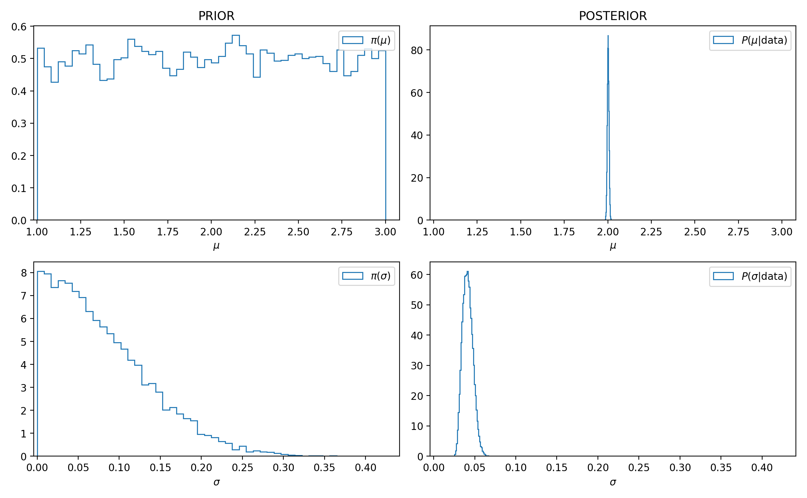

# KissABC

[](https://github.com/francescoalemanno/KissABC.jl/actions)
[](https://codecov.io/gh/francescoalemanno/KissABC.jl)
[](https://francescoalemanno.github.io/KissABC.jl/stable)
[](https://francescoalemanno.github.io/KissABC.jl/dev)

Table of Contents
=================

  * [Warnings](#warning)
  * [Beginners Usage Guide](#usage-guide)
  * [Details](#details)

## Warning
The objective of this package is implementing the most efficient ABC algorithms in their most general form, this package (right now) does not fullfill this goal entirely, although with some care you can still take advantage of `KissABC`

## Usage guide

The ingredients you need to use Approximate Bayesian Computation:

1. A simulation which depends on some parameters, able to generate datasets similar to your target dataset if parameters are tuned
1. A prior distribution over such parameters
1. A distance function to compare generated dataset to the true dataset

We will start with a simple example, we have a dataset generated according to an Normal distribution whose parameters are unknown
```julia
tdata=randn(1000).*0.04.+2
```
we are ofcourse able to simulate normal random numbers, so this constitutes our simulation
```julia
sim((μ,σ), param) = randn(100) .* σ .+ μ
```
The second ingredient is a prior over the parameters μ and σ
```julia
using Distributions
using KissABC
prior=Factored(Uniform(1,3), Truncated(Normal(0,0.1), 0, 100))
```
we have chosen a uniform distribution over the interval [1,3] for μ and a normal distribution truncated over ℝ⁺ for σ.

Now all that we need is a distance function to compare the true dataset to the simulated dataset, for this purpose a Kolmogorov-Smirnoff distance is good
```julia
using StatsBase
function ksdist(x,y)
    p1=ecdf(x)
    p2=ecdf(y)
    r=[x;y]
    maximum(abs.(p1.(r)-p2.(r)))
end
```
Now we are all set, we can use `ABCSMCPR` which is sequential Monte Carlo algorithm to simulate the posterior distribution for this model
```julia
res,Δ = ABCSMCPR(prior, sim, tdata, ksdist, 0.1, nparticles=200,parallel=true)
```
we chose a tolerance on distances equal to `0.1`, a number of simulated particles equal to `200`, we enabled Threaded parallelism, and ofcourse the first four parameters are the ingredients we set in the previous steps, the simulated posterior results are in `res`, while in `Δ` we can find the distances calculated for each sample.
We can now extract the results:
```julia
prsample=[rand(prior) for i in 1:5000] #some samples from the prior for comparison
μ_pr=getindex.(prsample,1) # μ samples from the prior
σ_pr=getindex.(prsample,2) # σ samples from the prior
μ_p=getindex.(res,1) # μ samples from the posterior
σ_p=getindex.(res,2) # σ samples from the posterior
```
and plotting prior and posterior side by side we get:


we can see that the algorithm has correctly inferred both parameters, this exact recipe will work for much more complicated models and simulations, with some tuning.

## Details
This package currently implements two algorithms whose details can be found in Docs

1. `ABC` this is a standard rejection algorithm, you can find an example in `test/runtests.jl`
1. `ABCSMCPR` this is the sequential monte carlo algorithm by Drovandi et al. 2011, you can find an example in `test/runtests.jl`
